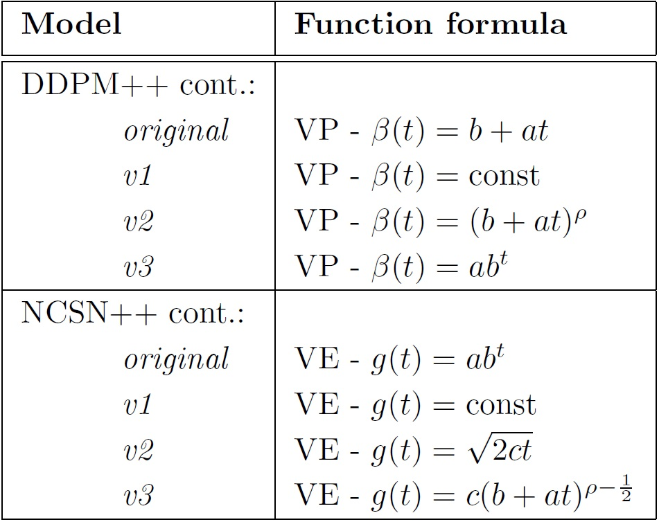

# <p align="center">Wasserstein Convergence Guarantees for Score-Based Generative Modeling </p>

<div align="center">
  <a href="https://www1.se.cuhk.edu.hk/~xfgao//" target="_blank">Xuefeng&nbsp;Gao</a> &emsp; <b>&middot;</b> &emsp;
  <a href="https://github.com/HoangNguyenM" target="_blank">Hoang&nbsp;Nguyen</a> &emsp; <b>&middot;</b> &emsp;
  <a href="https://sites.google.com/view/lingjiongzhu" target="_blank">Lingjiong&nbsp;Zhu</a>
  <br> <br>
  <a href="https://github.com/HoangNguyenM" target="_blank">Paper</a> &emsp;
</div>
</p>

--------------------

Based on the framework of the previous work on score-based generative models through stochastic differential equations (SDEs), we propose some new SDEs and analyze the Wasserstein convergence of the model using the new VE and VP SDE types. The models analyzed in our paper are listed in the figure below:



Our work provides a better understanding of the theoretical guarantees on score-based models, as well as demonstrates the alignment between theoretical results and experiments via testing on uniformly dequantized CIFAR-10 images. The summary of our theoretical analysis con be summarized in the table below:


## Understanding the code

Our implementation is mainly a modification on the framework provided by [Score-Based Generative Modeling through Stochastic Differential Equations](https://openreview.net/forum?id=PxTIG12RRHS), with the models **NCSN++** for VE SDEs from [Generative Modeling by Estimating Gradients of the Data Distribution](https://arxiv.org/abs/1907.05600), and **DDPM++** VP SDEs from [Denoising Diffusion Probabilistic Models](https://arxiv.org/abs/2006.11239). Our code also supports new SDE types of VE and VP SDEs, which are shown above.

## References

If you find the code useful for your research, please consider citing our paper:
```bib
TBD
```